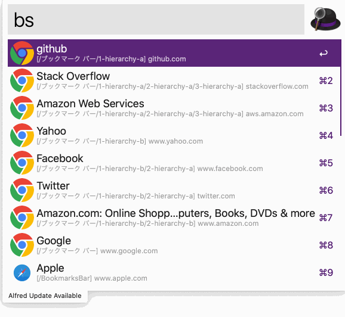

## alfred bookmarks

The workflow is a cross-browser bookmark searcher across Firefox, Google Chrome and Safari.

## Install

- Download and open the workflow with terminal.

```
$ curl -O -L https://github.com/konoui/alfred-bookmarks/releases/latest/download/alfred-bookmarks.alfredworkflow && open alfred-bookmarks.alfredworkflow
```

- Build the workflow on your computer.

```
$ make package
$ ls
alfred-bookmarks.alfredworkflow (snip)
```

## Usage

Please type `bs <query>` and select your desired bookmark to open on default web browser.



## Customize Configuration

Please create configuration file as `.alfred-bookmarks.yaml` in home directory (`~/`) if you want to customize.

```
firefox:
    enable: true
    profile_name: "default"
    profile_path: "${HOME}/Library/Application Support/Firefox/Profiles"
chrome:
    enable: true
safari:
    enable: false
remove_duplicates: true
```

If the configuration file does not exists, the workflow try to use available bookmark files of web browsers.

## Feature

- Supports fuzzy search.
- Supports following web browsers.
  - Firefox
  - Google Chrome
  - Safari
- Supports options
  - filter by folder name.
    - e.g. `bs -f <folder-name> <query>`
  - clear cache data.
    - e.g. `bs --clear <query>`

## Limitation

### Firefox

The workflow reads latest bookmark data from `~/Library/Application Support/Firefox/Profiles/<xxxxx>.default/bookmarkbackups/` directory.
If you register a web site to bookmarks, the workflow does not search the web site immediately.

## License

MIT License.
